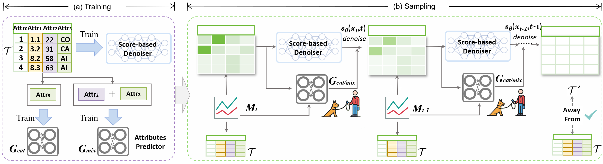

# (ICLR 2025 Submission) TAME: Towards Memorization-Free Table Synthesis via Diffusion Models

## Introduction
<div align="center">
<figure style="text-align: center;">
    
    <figcaption>Figure 1: Guidance pipeline of TAME.</figcaption>
</figure>
<br>
</div>

Diffusion models have gained notable attention
for their capacity to synthesize high-quality tabular data. 
However, research indicates that the distribution of some outputs strikingly resembles that of the training data. This similarity could
pose legal challenges for model owners, especially when the synthesized tables include sensitive attributes. In this paper, we conduct a series of investigations into the causes of memorization in diffusion models when synthesizing
tabular data. We discover that memorization occurs primarily during the sampling process, and intensifies as the complexity between categorical attributes increases. To address this issue, we propose TAME, a framework designed to mitigate memorization of tabular diffusion model in sampling process. TAME provides comprehensive memory guidance, ranging from categorical to mixed-type attributes in tabular data. We integrate TAME into two state-of-the-art table diffusion models, TabSyn and TabDDPM. Experimental results across various datasets demonstrate that TAME achieves memorization-free outputs while  maintaining high-quality data generation.

## Performance
<div align="center">
  <figure style="text-align: center;">
    
    <figcaption>Figure 2: The performance of TAME and baselines under four mixed-type dataset of in terms of Mem.Ratio(%), MLE and data quality.</figcaption>
  </figure>
  <figure style="text-align: center;">
    
    <figcaption>Figure 3: Heatmaps of the pair-wise column correlation of synthetic data v.s. the real data. </figcaption>
  </figure>

  <figure style="text-align: center;">
    
    <figcaption>Figure 4: Visualization of synthetic data’s single column distribution density v.s. the real data. </figcaption>
  </figure>
  <br>
</div>

## Installing Dependencies

Python version: 3.10

Create environment

```
conda create -n tame python=3.10
conda activate tame
```

Install pytorch
```
pip install torch torchvision torchaudio
```

Install other dependencies

```
pip install -r requirements.txt
```


Create another environment for the quality metric (package "synthcity")

```
conda create -n synthcity python=3.10
conda activate synthcity

pip install synthcity
pip install category_encoders
```

## Training Models

For tabDDPM, use the following command for training:

```
python main.py --dataname [NAME_OF_DATASET] --method [NAME_OF_BASELINE_METHODS] --mode train
```

Options of [NAME_OF_DATASET]: adult, default, shoppers, cardio_train
Options of [NAME_OF_BASELINE_METHODS]: tabddpm

For TabSyn, use the following command for training:

```
# train VAE first
python main.py --dataname [NAME_OF_DATASET] --method vae --mode train

# after the VAE is trained, train the diffusion model
python main.py --dataname [NAME_OF_DATASET] --method tabsyn --mode train
```

## Tabular Data Synthesis

For baseline methods, use the following command for synthesis:

```
python main.py --dataname [NAME_OF_DATASET] --method [NAME_OF_BASELINE_METHODS] --mode sample --save_path [PATH_TO_SAVE]
```

For Tabsyn, use the following command for synthesis:

```
python main.py --dataname [NAME_OF_DATASET] --method tabsyn --mode sample --save_path [PATH_TO_SAVE]
```

The default save path is "synthetic/[NAME_OF_DATASET]/[METHOD_NAME].csv"

## Memorization Ratio

```
python cal_memorization.py
```

## Evaluation
We evaluate the quality of synthetic data using metrics from various aspects.

```
python -m eval.eval_all
```


#### Alpha Precision and Beta Recall ([paper link](https://arxiv.org/abs/2102.08921))
- $\alpha$-preicison: the fidelity of synthetic data
- $\beta$-recall: the diversity of synthetic data

```
python eval/eval_quality.py
```

## Acknowledgements

This project was built upon code from [TabSyn](https://github.com/amazon-science/tabsyn). We are deeply grateful for their open-source contributions, which have significantly helped shape the development of this project.

Specifically, many of the model components in this repository are based on the foundation provided by [TabSyn](https://github.com/amazon-science/tabsyn). We highly recommend checking out their work for further insights.
